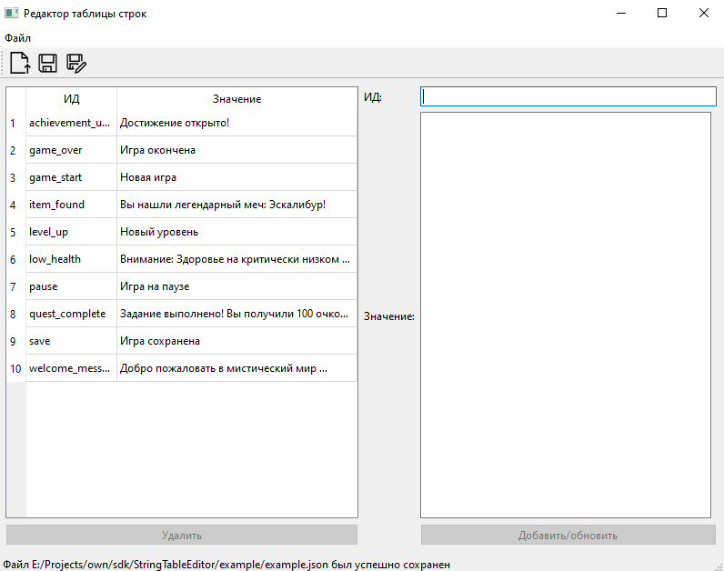

## StringTable Edtitor (Редактор таблицы строк)



### Описание проекта

StringTable Edtitor - это графическое приложение на Qt/C++ для управления таблицей строк. Программа позволяет удобно добавлять, редактировать, удалять текстовые строки, а также сохранять и загружать их в формате JSON.

### Основные возможности

**📋 Управление строками**
- Добавление/редактирование строк - введите ID и значение, нажмите "Добавить/Обновить"
- Удаление строк - выберите строку в таблице и удалите её

**💾 Работа с файлами**
- Сохранение в JSON - экспорт всей таблицы строк в JSON-файл
- Загрузка из JSON - импорт данных из существующего JSON-файла

### Структура JSON-файла

```json
{
    "game_start": "Начать игру",
    "game_over": "Конец игры!",
    "level_up": "Повышение уровня!",
    "pause": "Пауза",
    "quest_complete": "Задание выполнено!"
}
```

### Программа идеально подходит для:
- **Локализации игр** - управление текстами на разных языках
- **Редактирования игрового текста** - диалоги, описания, интерфейс

### Лицензия
MIT License - свободное использование и модификация.