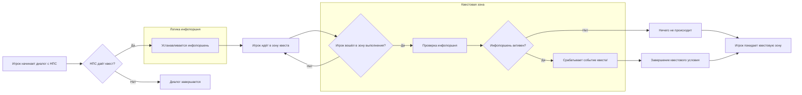

---
tags:
  - note
  - gamedev
  - gameplay
  - infoportion
---
**Инфопоршень** (infoportion) — это часть системы сюжетной информации, которая обеспечивает **происхождение** сюжетного события в игре. При помощи ССИ можно задавать:
- **Условие выполнения** задания.
- **Условие провала** задания.
- **Условие начала** нового задания.

 Условно они разделяются на три группы:
- **Сюжетные** — обозначают завершение какого-либо события, задания.
- **Квестовые** — описывают продвижение персонажа внутри одного задания.
- **Вспомогательные** — используются для синхронизации скриптов или событий.

Стоит понимать, что разделение это условное и вне зависимости от типа инфопоршней, все они описываются идентично и обладают равными возможностями. Разница только в смысловом наполнении.
### Принцип работы

> Важно! Инфопоршень всегда находится у одного объекта — если установить его у игрока, то он не появится у торговца (НПС), и наоборот.