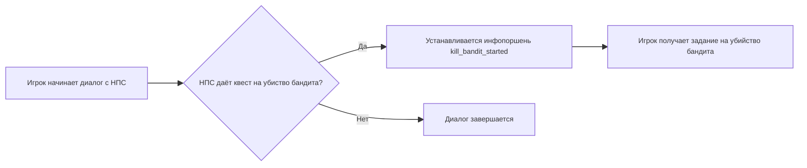
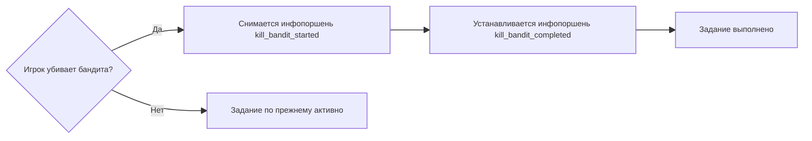
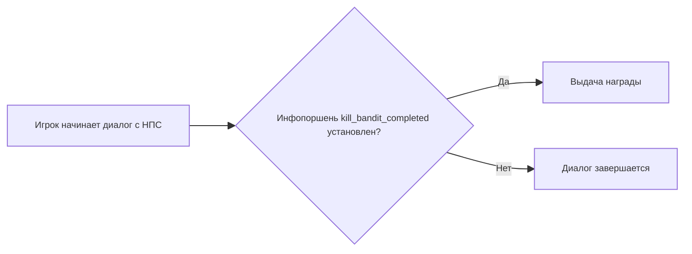

---
tags:
  - note
  - gamedev
  - gameplay
  - infoportion
---
**Инфопоршень** (infoportion) — это именованный **флаг-состояние** для записи и проверки фактов в игре. Сам по себе инфопоршень не производит видимых действий, но его наличие или отсутствие служит **универсальным триггером** для изменения игрового мира: смены поведения NPC, активации квестов и определенных диалогов.

Условно они разделяются на три группы:
- **Сюжетные** — обозначают завершение какого-либо события, задания.
- **Квестовые** — описывают продвижение персонажа внутри одного задания.
- **Вспомогательные** — используются для синхронизации скриптов или событий.

Это условное разделение и вне зависимости от типа инфопоршней, все они описываются идентично и обладают равными возможностями. Разница только в смысловом наполнении.
### Рассмотрим пример

Инфопоршни должны быть заранее объявлены. Обычно их регистрируют в отдельном конфигурационном файле игре, но мы для простоты изложения материала представили список возможных инфопоршней через обычный массив:

```cpp
const char* infoportions[] = {
	"kill_bandit_started",
	"kill_bandit_completed"
};
```

Таким образом, у нас есть два инфопоршня:
- `kill_bandit_started` - будем выдавать игроку, когда он берёт квест на убийство бандита;
- `kill_bandit_completed` - будем выдавать игроку, когда он убивает бандита.

Диаграмма логики выдачи квеста на убийство бандита в диалоге с НПС:



Диаграмма логики завершения квеста:



В диалогах инфопоршни используются для проверки условий и изменения состояния игры. Следующая диаграмма показывает, как проверка наличия инфопоршня `kill_bandit_completed` у игрока управляет доступными репликами НПС и выдаёт награду.



> Если задания однотипные, можно многократно использовать один и тот же инфопоршень заново активируя его.

Таким образом, инфопоршни позволяют задавать:
- **Условие выполнения** задания.
- **Условие провала** задания.
- **Условие начала** нового задания.

Система инфопоршней позволяет игровому движку **автоматически сохранять и загружать все инфопоршни** при загрузке сохранения игры. Без инфопоршней вам пришлось бы:
- Создавать отдельные переменные для каждого состояния.
- Писать код сохранения этих переменных.
- Писать код загрузки.

**С инфопоршнями все проще:** вы просто создаете флаги и работаете с ними. Движок делает всю рутинную работу за вас.
